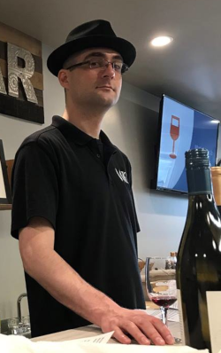

 

>> "Within C++, there is a much smaller and cleaner language struggling to get out."
>>
>> "And no, that smaller and cleaner language is not Java or C#."
>>
>> -Bjarne Stroustrup

---

 

<h2>Christopher Mabon</h2>

    

        
        
    

    

        
        
<iframe class="github-badge" src="https://githubbadge.appspot.com/chrismabon?s=1&a=0" style="border: 0;height: 100%;width: 100%;overflow: visible;margin: 0;" frameBorder="0"></iframe>
        
<a class="LI-simple-link" href='https://www.linkedin.com/in/chrismabon?trk=profile-badge'>Chris Mabon</a>

        <table> 
                    <tbody>
                        <tr>
                            <td>
<strong>Email</strong>
</td>
                            <td>
<a href="mailto:chris.mabon@protonmail.com">chris.mabon@protonmail.com</a>
</td>
                        </tr>
                    </tbody>
        </table>
        
Hello!

        
A developer of apps and websites, I 
            own/admin a personal AWS web server and enjoy tinkering around with 
            various Linux systems. My favorite languages include JavaScript, Python, C/C++, and Java. 
            In terms of databases, I am familiar with PostgreSQL, mySQL, and SQLite.

        
My time as a budtender at a busy dispensary has been an 
            explosive learning experience: The need to quickly understand a hefty sum of
            information on the topic of cannabis has elevated my level of understanding
            to "expert". Familiar topics include cannabinoids, terpenes and the ensemble effect,
            medical-use, legalization status, and strain genetics.

        
No stranger to vino, I worked in boutique a wine 
            and spirits store for nearly 8 years, acquiring a wealth of knowledge concerning
            the sale, consumption, and preservation of various fine wines and liquors. The
            picture to the left is a shot of myself sampling the bouquet (smell) of one of the wines
            poured at the tasting events I would conduct for the store.

    

