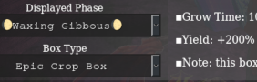
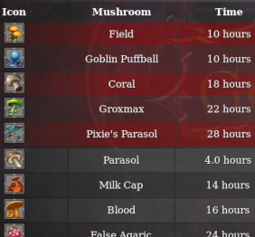
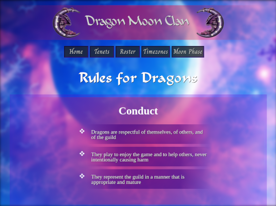
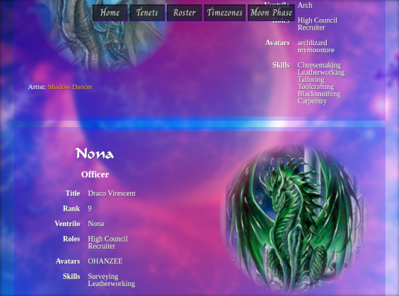

 

>> "The package system was not designed to manage software. It was designed to facilitate collaboration."
>> 
>> -Ian Murdock

---

<h2>🌙Phase Pharmer</h2>

    

        
JavaScript
 
        
What began as a simple spreadsheet, 🌙Phase Pharmer
            is a web app that organizes and displays information about
            the mushroom farming skill in Project: Gorgon (an online fantasy 
            role-playing game). 

        
The app is hosted live and available to any 
            player to use at their convenience. It gives the time for 
            each mushroom to grow, which substrate is best, and handily
            displays information about various grow boxes.

        
Calculating the moon phase to the minute requires some 
            trigonometry! For example, to find the "local hour angle", 
            one takes the arctangent of:
 
        <code>
            <ul>
                <li>sin A ➗ (cos A sin φ + tan h cos φ)</li>
            </ul>
        </code>
            
where:

        <code>
            <ul>
                <li>A ⇒ azimuth from the south</li>
                <li>φ ⇒ observer's latitude</li>
                <li>h ⇒ altitude</li>
            </ul>
        </code>
        
Etc.

    

    

        
        
    

    

        
    

<h2>Guild Website</h2>

    

        
Python & JavaScript
 
        
What modern gaming guild would be 
            complete without a website? After initially using only pure 
            HTML/CSS and Apache2, I ported the site to the Flask
            web microframework.

        
Heavy use of CSS gradients, 
            transparency, and special background image effects 
            characterize the site. Exotic fonts add to the inherent 
            mystical feel.

    

    

        
        
A useful trick using JavaScript is to 
            force the navigation area to "stick" to the top of the page
            after scrolling down far enough.
            As one can see from the screenshots, the 
            navigation bar seems to not scroll down past a certain point, 
            keeping navigation items in visual range at all times.

        
        
This makes the site more accessible to
            mobile users who lack the large screen experience of the 
            desktop.

    

<h2>Encryption Machine</h2>

    

        
Java
 
        

        

        

    

    

    

    

    

